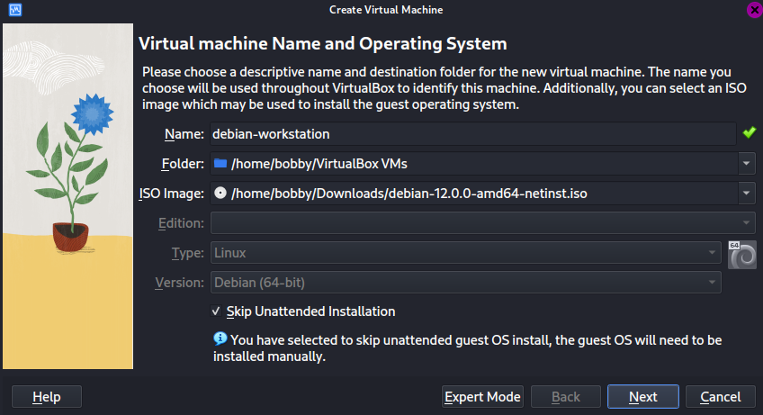
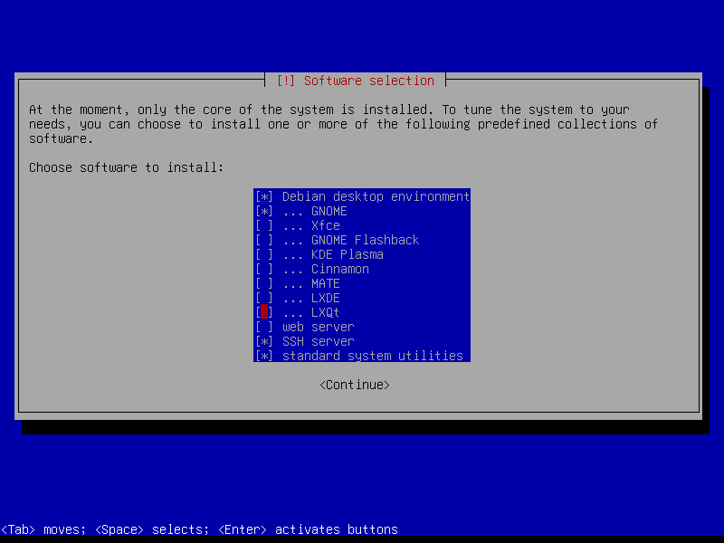
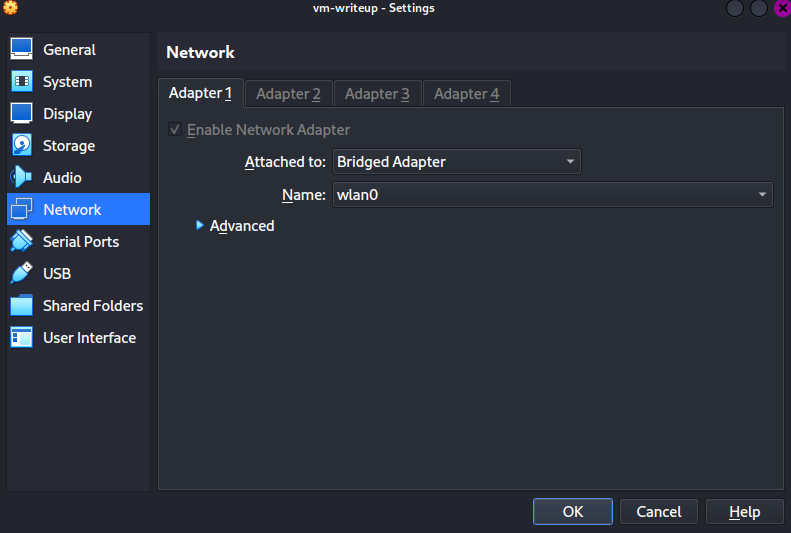
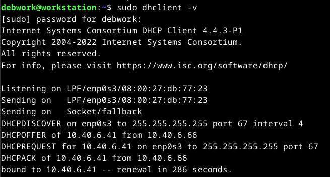

# bc_linux_network_project
BeCode Linux Module - Linux Project

## Table of Contents
- [bc\_linux\_network\_project](#bc_linux_network_project)
  - [Table of Contents](#table-of-contents)
  - [Project Context](#project-context)
  - [Must Have](#must-have)
- [Workstation VM Setup](#workstation-vm-setup)
  - [Steps](#steps)
    - [__1. Creating the New VM__](#1-creating-the-new-vm)
    - [__2. Installing Linux on the VM__](#2-installing-linux-on-the-vm)
    - [__3. Setting Up the VM__](#3-setting-up-the-vm)
- [Server VM Setup](#server-vm-setup)
  - [Steps](#steps-1)
    - [__1. Install sudo and add user to sudoers__](#1-install-sudo-and-add-user-to-sudoers)
    - [__2. Setting up the firewall__](#2-setting-up-the-firewall)
    - [__3. Setting server's IP__](#3-setting-servers-ip)
    - [__4. Installing GLPI__](#4-installing-glpi)
    - [__5. Setting up a DNS server__](#5-setting-up-a-dns-server)
    - [__6. Setting up a DHCP server__](#6-setting-up-a-dhcp-server)
    - [__7. Weekly Backup of Configurations__](#7-weekly-backup-of-configurations)
- [Encountered Problems](#encountered-problems)
  - [__On the Workstation__](#on-the-workstation)
  - [__On the Server__](#on-the-server)
  - [__Useful Links__](#useful-links)

## Project Context

The local library in your little town has no funding for Windows licenses so the director is considering Linux. Some users are sceptical and ask for a demo. The local IT company where you work is taking up the project and you are in charge of setting up a server and a workstation.
To demonstrate this setup, you will use virtual machines and an internal virtual network (your DHCP must not interfere with the LAN).

You may propose any additional functionality you consider interesting.

## Must Have

Set up the following Linux infrastructure:

1. One server (no GUI) running the following services:
    - DHCP (one scope serving the local internal network)  isc-dhcp-server
    - DNS (resolve internal resources, a redirector is used for external resources) bind
    - HTTP+ mariadb (internal website running GLPI)
    - **Required**
        1. Weekly backup the configuration files for each service into one single compressed archive
        2. The server is remotely manageable (SSH)
    - **Optional**
        1. Backups are placed on a partition located on  separate disk, this partition must be mounted for the backup, then unmounted

2. One workstation running a desktop environment and the following apps:
    - LibreOffice
    - Gimp
    - Mullvad browser
    - **Required** 
        1. This workstation uses automatic addressing
        2. The /home folder is located on a separate partition, same disk 
    - **Optional**
        1. Propose and implement a solution to remotely help a user

# Workstation VM Setup

We'll setup a debian virtual machine with a graphical desktop environment using VirtualBox.

## Steps

### __1. Creating the New VM__

First we need a debian ISO, you can get yours [here](https://www.debian.org/distrib/), I will be using the latest release, debian 12.

Once the ISO downloaded, we can set up the new VM on VirtualBox.

Click on "NEW", fill out the name, select the ISO you just downloaded and check "Skip Unattended Installation".



Allocate at least 2048MB of RAM and 2 CPU cores since we're gonna run a desktop environment on it.

Allocate 30GB of hard drive space or more.

Finish.

---

### __2. Installing Linux on the VM__

A basic linux installation, I will choose the "Install" option, it's more convenient for me than the gaphical install.

Select your language.

Select your location.

Configure the keyboard.

Wait.

Configure the network, I will go with the "workstation" hostname and domain name.

I choose "root" as default password. (security number one priority)

"workstation" for the full name and username, "root" as password. (lol)

Wait, then for the partition use the entire disk, select the disk and <ins>__make sure to separate the /home partition__</ins>, then finish partitioning and write the changes to the disk.

Wait.

Don't scan for the extra installation media, select your mirror country, deb.debian.org as the archive and no proxy.

Participate in the package survey if you wish.

<ins>__For the Software Selection, select Debian desktop environment and select the environment that you like. I will be choosing GNOME and don't forget to tick SSH aswell.__</ins> (spacebar to select and deselect)



---

### __3. Setting Up the VM__

Once your machine is turned on, the first thing we have to do is add your user to the sudoers.

```sh
su root
```
```sh
sudo usermod -aG sudo YOUR_USERNAME
```
```sh
exit
```
Restart your VM

-----------------------------------------

We'll start installing the consumer software.

[Libre Office](https://www.libreoffice.org/)
LibreOffice is installed by default on most popular linux distributions, but if it isn't on yours, type
```sh
sudo apt install libreoffice
```

[GIMP](https://www.gimp.org/)
```sh
sudo apt install gimp
```

[MULLVAD Browser](https://mullvad.net/en/download/browser/linux)

Download it from their website.

```sh
cd Downloads
```
```sh
tar xf mullvad-browser-linux64-[YOUR_VERSION].tar.xf
```
```sh
rm mullvad-browser-linux64-[YOUR_VERSION].tar.xf
```
```sh
mv mullvad-browser ~/
```
```sh
cd
```
```sh
cd mullvad-browser
```
```sh
./start-mullvad-browser-desktop --register-app
```

Now you have mullvad browser registered in your applications.

---

We'll also set up the remote help straight away since it's just some more installs.

To be able to remotely connect to a user, we'll use xrdp. ([RDP](https://en.wikipedia.org/wiki/Remote_Desktop_Protocol) stands for Remote Desktop Protocol)


```sh
sudo apt update
```
```sh
sudo apt install xrdp
```
```sh
sudo systemctl status xrdp
```

If it's not running, enable it:
```sh
sudo systemctl enable --now xrdp
```

Add the xrdp user to the ssl-cert group:
```sh
sudo adduser xrdp ssl-cert
```

Restart the xrdp server:
```sh
sudo systemctl restart xrdp
```

We can also install Remmina to be able to help a user from another workstation:
```sh
sudo apt install remmina
```

We can already set up the Uncomplicated Firewall for the future and allow the RDP port:
```sh
sudo apt install ufw
```
```sh
sudo ufw allow 3389
```
```sh
sudo ufw enable
```

-----------------------------------------

We'll try to remotely connect to another machine, for that we need to change our VM's network type and set it to Bridged.

Shut down your VM, go to Settings > Network and in Adapter 1 switch NAT to Bridged Adapter.



You can now remotely connect to your workstation from another machine on the network.

To know your workstation's IP:
```sh
ip a
```

It will probably be something like 10.40.X.X.


<ins>__You cannot remotely connect into a machine with an ongoing session with xrdp, either create a guest user or logout.__</ins>

-----------------------------------------

# Server VM Setup

The [server VM creation and setup](#1-creating-the-new-vm) are pretty much the same as the Workstation's ones with one exception, deselect any desktop environment and select SSH and Web Server.

We'll start by setting our Network Adapter to Bridged in our VM, same as with the Workstation aswell.

<ins>Shut down your VM, go to Settings > Network and in Adapter 1 switch NAT to Bridged Adapter.</ins>

-----------------------------------------

## Steps

### __1. Install sudo and add user to sudoers__

First step, install sudo and add your user to the sudoers group:
```sh
su root
```
```sh
apt install sudo
```
```sh
usermod -aG sudo YOUR_USERNAME
```
```sh
exit
```

Test sudo and privilege:
```sh
sudo apt update
```

-----------------------------------------

### __2. Setting up the firewall__

Then we'll install the Uncomplicated Firewall and set it up for the future:
```sh
sudo apt install ufw
```
```sh
sudo ufw enable
```
```sh
sudo ufw allow SSH,80,443,53
```

(80 for HTTP, 443 for HTTPS and 53 for DOMAIN)

-----------------------------------------

### __3. Setting server's IP__

After that, we'll be setting a static IP to our server:
```sh
sudo apt install network-manager
```
```sh
sudo nano /etc/network/interfaces
```

And comment out the lines (add # in front of the lines):
>#allow-hotplug enp0s3
>
>#iface enp0s3 inet dhcp

The command to set a static IP, be cautious to replace the X's with the IP you want to assign to your server:
```sh
nmcli con mod "Wired connection 1" ipv4.addresses "10.40.X.X/16" ipv4.gateway "10.40.0.1" ipv4.dns "" ipv4.dns-search "" ipv4.method "manual"
```

You now have a server with a static IP.

-----------------------------------------

### __4. Installing GLPI__

We'll use a convenient [little script](https://github.com/jr0w3/GLPI_install_script) that'll install and set up GLPI with and Apache2 server and a MardiaDB database.

We'll have to give it the root privilege:
```sh
su root
```
```sh
wget https://raw.githubusercontent.com/jr0w3/GLPI_install_script/main/glpi-install.sh && bash glpi-install.sh
```

Follow the scripts instructions.

When the script finishes doing its thing, we are supposed to restart apache2 but it wont work, so we run this:
```sh
sudo ln -s /etc/apache2/mods-available/rewrite.load /etc/apache2/mods-enabled/rewrite.load
```
```sh
sudo systemctl restart apache2
```
```sh
sudo systemctl enable apache2
```
If everything went according to plan, you should be able to access your GLPI interface by going to your machine's IP with a browser. To find the IP to go to, type:
```sh
ip a
```

The default credentials for GLPI are glpi:glpi.

-----------------------------------------

### __5. Setting up a DNS server__

Follow [this tutorial](https://computingforgeeks.com/configure-master-bind-dns-server-on-debian/).

A few important notes:

* You can use nano instead of vim.
* In step 3, you can omit the mail exchanger config for the forward db and the PTR record IP for the reverse db.
* In step 4 when restarting, enabling and checking your DNS, replace 'bind9' with 'named'.
* In step 5 when writing in the resolv.conf, put the line with nameserver SERVER_IP at the top ofthe file.
* Ignore step 6.

-----------------------------------------

### __6. Setting up a DHCP server__

First we install it:
```sh
sudo apt install isc-dhcp-server
```
```sh
sudo nano /etc/default/isc-dhcp-server
```

Replace the last 2 lines with:
>INTERFACESv4="enp0s3"  
>#INTERFACESv6=""

Then we configure the DHCP:
```sh
sudo cp /etc/dhcp/dhcpd.conf /etc/dhcp/dhcpd.conf.old
```
```sh
sudo nano /etc/dhcp/dhcpd.conf
```

Paste in this config:
```
default-lease-time 600;
max-lease-time 7200;

ddns-update-style none;

authoritative;

option subnet-mask 255.255.0.0;
option broadcast-address 10.40.255.255;
option domain-name-servers [YOUR_SERVER_IP];
option domain-name "[YOUR_DOMAIN_NAME]";
option routers 10.40.0.1;

subnet 10.40.0.0 netmask 255.255.0.0 {
        range 10.40.X.X 10.40.X.X;
}
```

For the subnet mask range it is suggested you choose a small range for easier testing, i.e:
```
subnet 10.40.0.0 netmask 255.255.0.0 {
        range 10.40.5.100 10.40.5.120;
}
```
<ins>__Do not include the IP of your own DHCP server, set a range above or below it.__</ins>

Save and restart both VM's.

To verify that it's working proprely, __on your workstation__, run:
```sh
sudo dhclient -v
```

You should see a line like this:
>DHCPOFFER of YOUR_NEW_IP from YOUR_SERVER_IP



The final step to see if your DHCP and DNS are configured proprely and work together is to open a browser, and navigate to YOUR_DOMAIN_NAME that you set up during the DNS configuration. (i.e: I chose "wares.bobby.local" during my DNS config, if you follow the tutorial yours will be "ns1.something.local", that is what you'll navigate to with your browser)

You should be able to access your GLPI interface.

-----------------------------------------

### __7. Weekly Backup of Configurations__

First we need to create a new volume for your VM.

1. Shutdown your VM.
2. In VirtualBox, while your VM is selected, go to Settings.
3. Go to storage.
4. Click on the little hard drive on the left of "Controller:SATA".
5. Create on the top left.
6. Leave VDI selected -> Next.
7. Allocate the space you want (at least 5GB).
8. Select your new volume and click on "Choose".

You now have a new volume attached to your VM, to check your available disks on the VM, type:
```sh
lsblk
```

If you see a /dev/sdb then your additional drive exists.

Format the new extra drive to ext4:
```sh
sudo mkfs.ext4 /dev/sdb
```
Create a backup directory in /mnt:
```sh
sudo mkdir /mnt/conf_backups
```

Fun part; writing a script to mount our disk and backup our configuration files before unmounting it:
```sh
su root
```
```sh
cd
```
```sh
mkdir scripts
```
```sh
nano /root/scripts/conf_backup.sh
```

Paste in:
```
sudo mount /dev/sdb /mnt/conf_backups/
sudo mkdir /tmp/$(date +%d-%b-%Y)
sudo cp -r /etc/bind /etc/dhcp /etc/apache2 /etc/mysql /etc/php /etc/resolv.conf /tmp/$(date +%d-%b-%Y)/
sudo tar -zcvf /mnt/conf_backups/$(date +%d-%b-%Y).tar.gz /tmp/$(date +%d-%b-%Y)/
sudo rm -rf /tmp/$(date +%d-%b-%Y)
sudo umount /dev/sdb
```

Then we create a [cronjob](https://en.wikipedia.org/wiki/Cron) to launch the script every week on sunday at 9PM.

```sh
sudo crontab -u root -e
```
```
00 21 * * 7 /root/scripts/conf_backup.sh
```

-----------------------------------------

# Encountered Problems

## __On the Workstation__

<ins>__"Media change: please insert the disc labeled ... in the drive /media/cdrom"__</ins>

It can happen if you fed your machine the CD or DVD version of the ISO, to fix it you need to update your souces list.

```sh
sudo nano /etc/apt/sources.list
```

Delete or comment (#) the CDROM source and paste this:
```
deb http://deb.debian.org/debian bookworm main non-free-firmware
deb-src http://deb.debian.org/debian bookworm main non-free-firmware

deb http://deb.debian.org/debian-security/ bookworm-security main non-free-firmware
deb-src http://deb.debian.org/debian-security/ bookworm-security main non-free-firmware

deb http://deb.debian.org/debian bookworm-updates main non-free-firmware
deb-src http://deb.debian.org/debian bookworm-updates main non-free-firmware
```

And run:
```sh
sudo apt update
```

## __On the Server__

<ins>__Remmina connects to target and crashes shortly after (GNOME Desktop Environment)__</ins>

Apparently being a version issue of xrdp on debian 11, we can use [this](http://c-nergy.be/blog/?p=18918) to fix it:
```sh
sudo apt remove xrdp
```
```sh
wget https://c-nergy.be/downloads/xRDP/xrdp-installer-1.4.7.zip
```
```sh
cd ~/Downloads
```
```sh
unzip xrdp-installer-1.4.7.zip
```
```sh
sudo chmod +x xrdp-installer-1.4.7.sh
```
```sh
sh xrdp-installer-1.4.7.sh -c -l
```

<ins>__cronjob is running but script isn't executed__</ins>

If the script isn't executable by the root group, make sure to fix that otherwise the cron will run but nothing will happen. (if you created it with root, ignore)

```sh
sudo chmod 770 PATH_TO_YOUR_SCRIPT
```
-----------------------------------------

## __Useful Links__

[crontab.guru](https://crontab.guru/) to help you understand and configure a cronjob.

[Nmap](https://nmap.org/) to easily check what ports are open on your machine.
```sh
sudo apt install nmap
```
```sh
nmap localhost
```

[rsyslog](https://www.rsyslog.com/) to help you troubleshoot. (practical for cron)
```sh
sudo apt install rsyslog
```
The logs are located in /var/logs/system by default.
